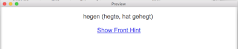
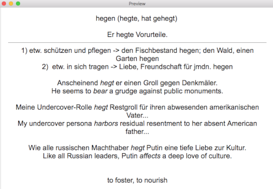
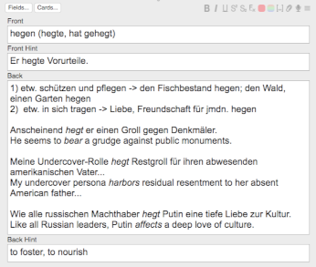
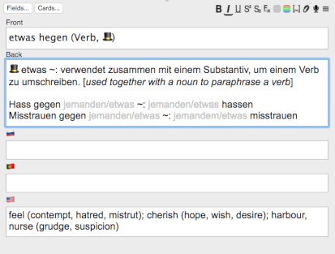
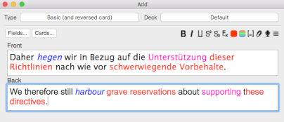
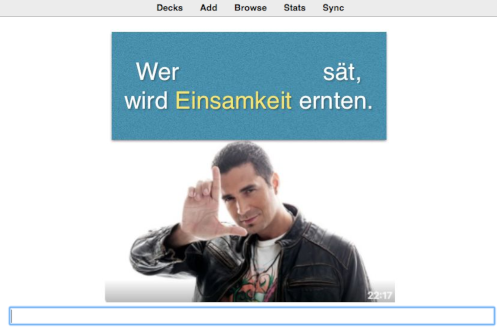
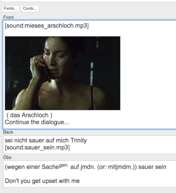
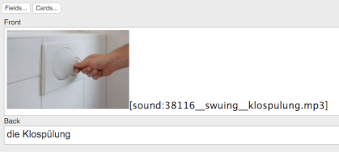
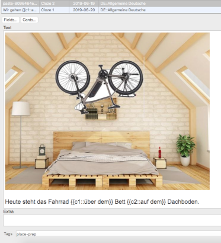
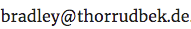

## Table of Contents
* [0 - Intro](#intro)
  * [0.1 - What to expect from this guide](#expec)
* [1 - Setup](#setup)
  * [1.1 - Creating cards](#create)
  * [1.2 - Studying cards](#study)
* [2 - Getting started with the mechanics](#getstart)
  * [2.1 - Topics you should study](#topics)
* [3 - Classical mistakes - what NOT to do](#whatnot)
  * [3.1 - Too much information](#infooverload)
  * [3.2 - Overlooking the importance of reverse cards](#reverse)
  * [3.3 - Overlooking the importance of media (audio, video, animation, pronunciation cards)](#media)
* [4 - Creating awesome cards](#awesomecards)
  * [4.1 - Good Note Type for learning the basic meaning of a word](#notetype)
  * [4.2 - Paired translations](#paired)
  * [4.3 - Learning with Memes & Image Clozes](#clozes)
  * [4.4 - Multimedia cloze: sounds and movies](#multimedia)
  * [4.5 - Sound effects from freesound.org](#freesound)
  * [4.6 - Creative use of pictures](#pics)

## 0 - Intro

After more than a decade without actively studying new languages, I recently decided to brush up my German🇩🇪 skills and started playing with a few other languages as well (Swedish🇸🇪, Russian🇷🇺). 

During this long hiatus, a lot of exciting new things happened in the space of language learning, and the multitude of tools we have available today in 2019 is just mind-blowing. When I last studied languages seriously, getting pronunciation and phonetics right was already a challenge. Now Google Translate can pronounce pretty well almost anything
in any language, and [forvo.com](https://www.forvo.com) has native speakers pronouncing almost everything imaginable, and even if what you want isn't there, you can just add new words and phrases yourself, and someone will pronounce it in your target language very soon. This is all mind-blowing. I wonder how much easier it would have been if I had those tools 20 years ago when first learning English.

This is this context in which I came across **Anki**. Based on the principles of *Active Recall Testing* and *Spaced Repetition*, it is a revolutionary tool for learning new things, in an *effective* manner. This post is not about preaching the benefits of **Anki** and even an extensive introduction to **Anki** is outside the scope of what I want to cover here. Check out the very good [Anki Manual](https://apps.ankiweb.net/docs/manual.html) for the mechanics of how to use the software, and also familiarize yourself with the [Twenty rules for formulating knowledge](http://www.supermemo.com/articles/20rules.htm). 

**2019-11-06 Update**: If you are new to Anki check this awesome Anki Guide for beginners: [How to Use Anki: Anki Tutorial for Beginners](https://improveism.com/how-to-use-anki-tutorial/).

**Anki** is pretty easy to use, and in no time you can start creating your own cards and training on new vocabulary. Even though the **mechanics** of cards creation is pretty simple, the correct and **effective** use of Flashcards takes a bit of practice and thought. What I have seen too often, is people creating terrible Flashcards (my self included), instead of learning how to create them properly first. So what I wanted to do is to share my experience built after trial and error and thousands of created cards, to shortcut you directly into creating awesome cards instead of having to learn this the hard away after hundreds of crappy cards and ineffective learning.

## 0.1 - What to expect from this guide
I will not spoon feed you everything nor will I just replicate info available elsewhere. I will give the pointers and topics you need to cover on your own, and guide you through the process of making awesome Flashcards with **Anki**. There will be some time investment necessary, this post will be long and the rest of the materials also take some time to settle. So if you want to follow it through, beware you will need to invest a few hours of quality time with this material. What I can promise you is that the effort pays off very nicely if you are serious about learning. Instead of forgetting new words  all the time, following this process and creating effective Flashcards will save you hundreds or thousands of hours later down the road in your language learning journey.

## 1 - Setup

First things first. Set up **Anki** on the platforms where you will create and study your cards. 

### 1.1 - Creating cards
Mobile devices are great for consumption of content but they are just terrible for content creation. You should definitely get one of the Desktop versions (Windows, Mac or Linux) and this is where you will create your cards. I also prefer to study on the Desktop myself, but you could also Sync your cards with an [Ankiweb](https://ankiweb.net/decks/) account (also good for backup reasons) and study across multiple computers and devices.

### 1.2 - Studying cards
As I said before I prefer to study on the Desktop, but mobile is good enough for studying too. I found the **Anki** App on an iPad to be particularly appealing. If you want to download the **Anki** apps for mobile (iOS, Android), go for it, and I would even highly encourage you to do so specially if **Anki** turns up being useful for you and you use iOS, since the [Author supports his livelihood](https://apps.ankiweb.net/support/) with the sales of the iOS app. I myself barely use the iOS app at all, but bought it as a sign of appreciation to the developer efforts.

If you end up with **Anki** in more than one device, remember to set up a [Ankiweb](https://ankiweb.net/decks/) account and Synchronize as often as necessary.

## 2 - Getting started with the mechanics 
If you are as anxious as me, you will want to have the app installed and get started with cards and studying right away. After all the whole point of this endeavour is to learn a language more effectively, not spending more time studying new software and Flashcard creation methodology. But bear with me, the effort is well worth it.

First I just want to emphasize the importance of **creating your own cards**. This is stressed enough on the documentation and everywhere, but the temptation of just downloading a set of cards to get started is too big. Specially so if you are studying a common enough language that will have a lot of public decks ready for consumption (looking at you, German, French, Chinese, ...). This might work for some people but for me it was a disaster. I couldn't understand where the words were coming from, and too often the approach of simply getting a list of x most frequent words and getting almost automated generated cards based on that is very naïve. There is simply no 1:1 correspondence word for word between your original language and your target language. Some words you will know already, others will you need more cards depending on the specific level of difficulty for you.

So be patient. I recommend you download a few public decks just to get familiarised with the mechanics, how the training works, edit and create a few cards, follow the official documentation from **Anki** to learn how to create your own Note types and customize your cards. Don't take it too seriously for now. Your first cards will probably suck and you are going to scrap it later for better cards, but you need to feel comfortable with the mechanics first before going into more advanced steps.

### 2.1 - Topics you should study
Playing with the app and reading the documentation, I highly recommend that you make yourself familiarised with the following topics:

* the basics: Cards, Decks, Notes & Fields, Card Types & Note Types
* Reverse Cards
* Cloze Deletion
* Tags & Flagging of Cards

## 3 - Classical mistakes - what NOT to do
Before going into recommended strategies of what works, I want to share some of my own bad examples, because I have seen exactly the same kind of mistakes over and over again in shared decks and also on people bashing *SRS* and **Anki** on the web. 

### 3.1 - Too much information 
The tutorials mention the [minimum information principle](http://www.supermemo.com/articles/20rules.htm) many times, but I at first got excited with all the features **Anki** offered, and created monstrosity of cards like the one below:

**Front** 

**Back** 

**Template** 

Let's break it down and analyse everything that is wrong with this card. First, the template for the Note is horrible. I got excited with adding Hints when I saw this feature on the Anki manual, and started abusing it. It at first seemed like a good idea, to have a Front Hint and a Back Hint. The idea would be that I would have the definition of my word in my target language on the back of the card, Front Hint would be a phrase using the word, whereas Back Hint could be the English translation.

This is a horrible card because it is simply too much information to expect you to memorise in one go. A good Flashcard will try to mimic the process by which your own brain stores information, which is in very small bite sized pieces. 

I also pack not only the definition in my target language (German in this case), but also different definitions that this verb might have - (1) and 2) in this case - as well as example phrases. All and all it is a mess, and I would just keep forgetting this card over and over again.

#### Learning
**Avoid this overload of information as much as possible**, it just makes you frustrated and it's so much harder to learn the cards fully this way. Of course language is a complex topic, and words will have many different subtle meanings. The proper way to tackle this is to have **multiple** Flashcards for a given word, instead of just trying to pack as much info as you can in one card. I will show you how to create a good Flashcard for **hegen** in the next session.

### 3.2 - Overlooking the importance of reverse cards
My Front-Hint/Back-Hint template was not only terrible (and I created almost 500 cards with this template 😫)   but 
also ignored that reverse cards are also extremely important. Basically, even if I learned this card thoroughly, I would be able to see the verb **hegen** in a text and understand some of its meanings, but I wouldn't necessarily be able to produce it on my own.

#### Learning
**Use plenty of reverse cards**, try to create Notes with templates that have a reverse, and when creating new cards, always consider if a template with a reverse side is appropriate. **Caveat**: you might be studying a language with the goal of attaining a certain vocabulary just for passive understanding. In this case, you might skip reverse and just go in one direction with the cards.

### 3.3 - Overlooking the importance of media (audio, video, animation, pronunciation cards)
My initial cards were all very terse, as the **hegen** example. This doesn't really make it easy on your brain with the task of learning the massive amounts of vocabulary that a new language entails. I used some pictures now and then but very timidly. Later cards now are much more creative, and I will show some positive examples in the next session.

#### Learning
Use as much alternative media as you can. Photoshop your own Cloze-images, investigate [Anki Add-ons Page](https://ankiweb.net/shared/addons/2.1) for creative extensions, add audio, video, animations, record your own voice for cards. Make the learning experience as diverse and multimedia as possible.

## 4 - Creating awesome cards

Finally the fun part and creative examples.

### 4.1 - Good Note Type for learning the basic meaning of a word

I created a template that works for my needs now, based on the *Basic (and reversed card)* from default **Anki**, with a simple twist: I just added three hint fields (that show on the back and the front), with potential help of one of the languages I already master. It's not necessary to have hints in all those 3 languages, sometimes I just add English, sometimes I add other source languages, it depends on how complex the word is for me, and also the ease of translation of the concept.

The verb **hegen** actually has 3 base meanings, and our old Note was using them almost interchangeably and without considering the formality of the register. We now create a note for each of these base meanings. So a note will become now three notes, which in turn will turn into 6 cards, since this Note template also does the reverse card. Also notice the 🎩 emoji. This signalises in afun way that this is a very ormal and sophisticated register (For example, **ich hege den Verdacht, dass...** would be something like **I entertain a suspicion, that ...**).

**C1 Template** 

For brevity I won't show the other two Notes for the other meanings of **hegen**, but you would just create them accordingly - assuming you want to learn and master all of the 3. It might also be fine to memorise only one of them, the most frequent, or the one that matters to you or the context you are studying.

### 4.2 - Paired translations

Notice that these Note/cards will only teach you the base meaning of the word, but won't teach you useful info on contextual usage. For this, I like to use translation pairs I obtain from [reverso.net](http://www.reverso.net), a great resource for contextually paired translations. I will just pick my target language and a language I am comfortable with, and create a simple basic and reverse card based on [that](https://context.reverso.net/translation/german-english/hegen#harbour):

**Paired translation Note** 

Their translations are not extremely curated though, so be careful and check. In this case for example, **nach wie vor** was simply missing from the translation and I added it manually when creating the card (**still**).

Now instead of a single Note and one card for learning the multiple meanings of **hegen** and their contextual examples, we would have at least 12 different cards to study, covering different usages and contexts. This also allows you to learn them at different pace and speed. As an added bonus, you will see that I coloured the bits in my translation pairs to show which words in my target language correspond to my main language. This allows you to learn not only the target word (in blue in this case, **hegen**), but also learn other words and structures as well!

Also these cards now are way more fun to review and study than our past monstrosity of a card for **hegen**.

### 4.3 - Learning with Memes & Image Clozes
If you've got this far you should already know how awesome of a learning tool Cloze cards are and should be using them extensively. I initially ignored them, but soon found how useful they can be in fostering information recall within a given context. Use and abuse them.

What I have been exploring recently is creating Image Clozes, using Gimp. I know that there are **Anki** Add-Ons that will do that for you, but I actually prefer the extra work of manipulating the image myself. I have a feeling that that somehow helps me with the impregnation of the word in my memory.

I am also coupling this with another fun component, which is translating obscure memes into my target languages and using that as a compounding learning effect. Someone once sent me the following meme:

I then translated it into German, (**Wer Schweinerei sät, wird Einsamkeit ernten**), which was already fun in itself, and removed the two nouns individually creating two Notes, with type Basic with type-in, such as the one below:

This deserves another blog post on its own, but follows another translated meme as a bonus:

### 4.4 - Multimedia cloze: sounds and movies

The concept of clozing is so cool because it's also very simple to extend it to audio and movies. Basically you can edit parts of an audio or video clip and remove words, and then create a card where you have to identify the removed words. I have been doing this with movie scenes for example (also a nice excuse to rewatch Matrix but in German):

### 4.5 - Sound effects from freesound.org

Another awesome resource I found recently is the [www.freesound.org](https://www.freesound.org) library of free sound snippets. When creating a card for a concept that has some auditory cue, I use their snippets to increase the notability of a card. For example, when creating a card for **die Klospülung**:

For this card I used a [toilet flushing sound](https://freesound.org/people/flunkspagnargel/sounds/238541/) I found on [www.freesound.org](https://www.freesound.org). In this particular card I have the sound and image together, but I have other cards with different combinations, for example on one side just the sound, on the other the image and the word.

### 4.6 - Creative use of pictures
I was one time checking my answers to a language exercise on propositions in German, and by mistake looked at the wrong part of the *Lösungsbuch*. It was about where Hans was placing his Fahrrad, and according to my wrong lookup it turns out he was putting it above his bed. That sounded a little weird to me, but when I realised the mistake I decided to create an image Flashcard based on this, because such a scene (bicycle stored over the bed) increases the memorability of a card.

I am not a Gimp wizard, but after struggling a bit I came up with cards like this:

So in the process of creating these cards I am playing with audio editing (Audacity), image editing (Gimp), video editing which also adds a bit of a nice break to the drill of studying and creating cards all the time.

## Closing remarks
That was a long post, but I hope it helps you write more effective cards. For comments just ping me on Twitter or mail me at:  

