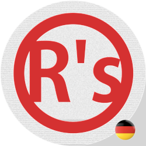

Seite schon eine Weile her gab es hier kein Updates mehr. Ich war tief
drin in meinem Weg zum Deutschlernen - und es bleibt weiterhin noch viel
mehr zu erobern.

Allerdings merke ich es halt schon dass ich viel mehr als vorher verstehe.
Dieses Wochenende zB habe ich mich endlich eine Serie von 2004 wieder angeschaut,
und merkte dass ich sogar ohne Untertitel fast schon 99% verstehe. Und es ist eine
deutsche Serie, dass heißt keinen Synchronsprecher ohne Akzent und klare Stimme. Es
gibt schon Murmeln und eine buntere Sprachvielfalt die man so in organischem Dialog
erwarten wurde. Und auch wenn ich es nicht alles auf einmal verstehe, kann ich ein 
paar Male zurückspülen und es kappieren. Das fühlte sich gut an. 

Deswegen bin ich mir jetzt zuversichtlich, dass Flüssigkeit bald kommt. Was
mir jetzt gerade meistens fehlt noch, ist Wortgewandtheit und nicht oft mehr
nach Wörtern suchen zu müssen.

Es verbessert sich deutlich jeden Tag, aber ich merke ich mich weiter 
dazu selbst erregen muss. Deswegen dieser neue Auftakt.

Ab jetzt schreibe ich hier nur auf Deutsch - es werden noch ziemlich viel Fehler
vorkommen - ich wette, aber Korrekturen sind herzlich Wilkommen (falls sich jemand 
überhaupt dafür was ich hier poste interessiere würde...).

Auf jeden Fall, ich freue mich darauf - und jetzt es geht ab!

Takt, Takt, Auftakt!

