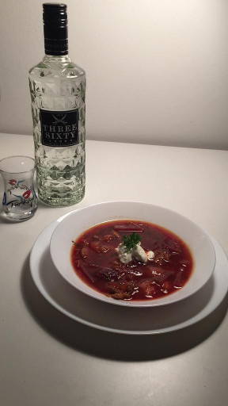
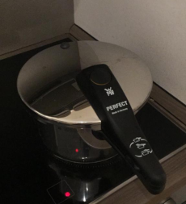

**Rubek's** is all about good food. Today we will share one of our most 
beloved recipes, for a very traditional Ukrainian dish called Borscht (the
transliteration varies sometimes. I don't think the *t* is so strong in the
original in Russian - Борщ, but Wikipedia [uses Borscht](https://en.wikipedia.org/wiki/Borscht) as their 
transliteration of choice so we will stick with that).

**It is not a very complex recipe to pull off**, but it cant be a bit lengthy,
especially so if you don't own a pressure cooker. We at *Rudbek's* have only
prepared it so far in a pressure cooker, specifically in this one:

So if you intended to prepare this recipe in a regular pan, please adjust your
cooking times accordingly.

## Ingredients

- Pork meat. 400g/500g (boneless) or 700g/800g (with bones - highly recommended
    for extra tastiness)
- 4 mid to large-sized beetroots
- 200g of white beans (dry)
- 3 carrots
- 2 onions (purple if you are feeling zesty)
- sour cream (or even better, Schmand, if you are in Germany)
- garlic
- any other extra veggies you might have lying around which
     would work good in a stew.
- salt, black pepper, and any other spices you might like
- 3 Bay leaves

### Beans Preparation (to be done the night before)

Wash your beans first and leave them overnight in a bowl with water and two
spoons of vinegar. They should soak there for at least 12 hours, to remove the
phytates that are bad for digestion. 

### Preparation Instructions

Start by washing the pork meat and adding it to your pressure cooker, together
with a generous amount of water (usually up to the minimum level as set by the
cooker or at least 2 liters). Put the bay leaves and the beans together with the pork. 
Close the pressure cooker, leave it on mid fire and let it cook for about 20 minutes
after it goes in to pressure cooking mode.

Dice the onions, grate the carrots and beetroots. Clean and prepare other veggies
you might want to add to your stew as well. Add some olive oil to another pan and
fry the onions for 5 minutes. When the onions are golden, add the garlic, the 
carrots and mix it well. Leave it on mid-fire for a few minutes, until the onions
are well cooked. By then they should also absorb a bit of the color of the carrots.
Add some more olive oil or water if necessary at this stage (you don't want
to burn the onions or the carrots).

Now add 75% of the beetroots, together with 5 tablespoons of the broth of the 
pork (it can also be regular chick broth or any other broth you might have,
in case the pressure cooker is still closed).  Mix it well, let it cook on slow
fire for 6 minutes with the closed lid. At this stage, you can also add your 
other veggies to the broth and the remaining 25% of the grated beetroots.

Add ground black pepper, other spices you might like, and a bit of salt. Let it
sit in slow fire for another 5 minutes, complementing with more broth if
necessary. 

Now it's time to add all the cooked veggies to the pork and beans. Mix it well,
and let it cook on the pressure cooker (with the open lid) for around 20 minutes
on slow to mid-fire.

Let it rest for 1 hour before eating. It usually gets even better the next day
(due to the biochemical reactions that still take place hours after cooking).

Add sour cream/Schmand to your liking when serving.

Share and enjoy!

