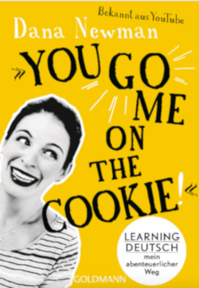

I've just finished reading _You Go Me on the Cookie_ (2019) by [Youtuberin](https://www.youtube.com/wantedadventure) [Dana Newman](https://www.dananewman.de/). 

Even though I knew her YouTube channel already I didn't know about her book, and found it by chance while browsing the German language session in a bookstore in Berlin. The main theme of the book is supposed to be the challenges of learning German as a second language, and as a student of German as a foreign language for a while now, I always missed this kind of book - so I purchased it right away in excitement. Surprisingly enough there is a scarcity of materials on this theme (that I could find). 

There are a few books written by German expats who eventually integrated and then talk about their integration into German culture (sometimes touching a bit on the language aspects, but only tangentially). In this group, the two that come to mind are [Make me German](https://www.ullstein-buchverlage.de/nc/buch/details/make-me-german-zweisprachiges-wendebuch-deutsch-englisch-9783548375595.html) from Adam Fletcher, or [Draußen nur Kännchen](https://www.fischerverlage.de/buch/prinz_asfa-wossen_asserate_draussen_nur_kaennchen/9783596181575) by Prinz Asfa-Wossen Asserate. I hope to review them soon as well, as soon as I manage to read them in German. 

Still, Dana's book is the first I found that tackles Learning German as a _main theme_. I read it almost in one sitting, the only thing barring me from reading it faster being my own incompetence in the German language and lack of vocabulary. I can say that I really like the book and recommend it highly. Coming from the perspective of a struggling German learner, it's nice to read war stories of someone who tried to learn this language and survived. This is the perspective from which I will review the book, which is interesting, since I don't seem to be the target audience for it.

The book structure is pretty simple and this is a very light reading. It is divided in small non-numbered chapters, without a specific order in which things are approached. It's almost like a collection of blog posts or anecdotes, which is cool - you could just pick up random chapters to read in any order without compromising your understanding. A few points worth mentioning:

### 1) The target audience is German native speakers

Perhaps the fact that the book is fully written in German should have been a giveaway, but it was with a little surprise that I found out through the reading that it's not specifically aimed at English-speakers learning German. This was a little annoying at first, because in many instances the writer just assumes you have a perfect command of German and even though she describes the things she struggled with and you can identify fine with that, it simply doesn't explain some things because, well, they would be just obvious for the native German speaker reading the book. 

Prime example for this is the _Lustiges Ratespiel_ chapter, which contains a list of slang words in German and her trying to interpret them. I could identify perfectly with the confusion that the author goes through with most of the words in the chapter (_Vi_ malochen, z.B.), but being far from the mastery of a native in the language, I had to resort many times to the dictionary and Google to try to understand these expressions myself.  It was a little inconvenient but consider it a guided vocabulary expansion opportunity.  

### 2) German language used in the book is VERY advanced

Since the book was written by someone who recently learned German I expected it to be a little easier on the reading, using simpler words and structures, almost like for example the level of German that Dana uses on her videos in German (for example: [2 Americans Speak ONLY GERMAN Together🇩🇪😳](https://www.youtube.com/watch?v=JEjCBGR34HM)). To my surprise the level of language used in this book is extremely advanced and conversational. It is even harder to read than formal German at some points, for a learner, due to the large number of colloquialisms and certain words I had never seem before. 

For example on Chapter _Wie die deutsche Sprache meine Denkweise verändert hat_ , in the _Nebenbemerkung_ box they use _der Usus_ as a word for describing a custom, instead of the more normal _Gebrauch_, _Brauch_ or _Gewohnheit_ which you usually encounter in any B2/C1/C2 German textbooks. 

This blew my mind a little, and made me few a little frustrated. How did Dana attain such a mastery of perfectly written colloquial German in such a short time? I just felt frustrated many times and thinking unrealistic to expect that I could ever reach this level so soon. But then at the end of the book I found out that she actually wrote it in colloquial English, and had it translated to German. So don't give up your German studies in despair!

### 3) Good points for improving your German

The exposure to colloquial written German is pretty interesting. Most of the reading you do as a learner is from very formal texts from academia, or _Der Spiegel_ and literature. And even if is a little hard at first because of certain words and constructs you may not be familiar with, the sentence structure tends to be a little more simplified and almost conversational. I would love to read more books written like this. 

### 4) Final remarks

Overall it was a light way to acquire new vocabulary and especially useful for exposing myself to written colloquial German. Highly recommended for Deutsch learners from B2-level upwards I'd say.

