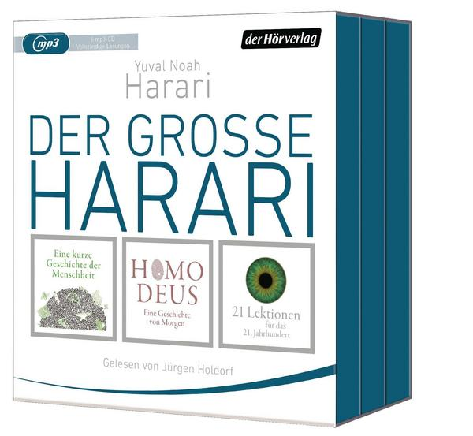

Ich habe vor kurzem die 3 Bestseller von Harari gelesen:

1. Eine kurze Geschichte der Menschheit (2011)
1. Homo Deus - Eine Geschichte von Morgen (2015)
1. 21 Lektionen für das 21. Jahrhundert

bP Link:
[Make me German](https://www.ullstein-buchverlage.de/nc/buch/details/make-me-german-zweisprachiges-wendebuch-deutsch-englisch-9783548375595.html) from Adam Fletcher, or [Draußen nur Kännchen](https://www.fischerverlage.de/buch/prinz_asfa-wossen_asserate_draussen_nur_kaennchen/9783596181575) by Prinz Asfa-Wossen Asserate. I hope to review them soon as well, as soon as I manage to read them in German. 

