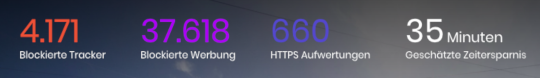

Howdy, thanks for stopping by.

As you can see on the footer of this website, all the content here is licensed using a very permissive license. Also all the source-code is available on a public Github repository. You are welcome to do whatever you see fit with it. If you want to send suggestions or corrections, just submit a PR via Github or ping me on Twitter.

This website has zero-tracking tools (not even cookies) and no ads-whatsoever. I do this because I believe the old model where content producers are monetised via invasive ads has turned the web into a mess. I have been using [Brave](https://www.brave.com 'Brave browser') as my main Browser for a while. It shows an interesting panel every time you open it:

Over a few weeks, it has blocked almost 40 THOUSAND ads and 4 THOUSAND trackers. And this is just in **one** of the computers I use. This is hideous not only from the perspective of being tracked almost 50k times, but also on the sheer waste of resources (bandwidth, computer processing power and memory, time).

But merely using a ad-blocker or a modern browser like Brave, does not solve the issue. It blocks the nasty ads, but leaves the content creators on a tough spot. This is where the [Basic Attention Token](https://basicattentiontoken.org/) framework created by Brave is trying to turn the users back into users and not a product to be sold. 

## How to help

1. Download [Brave](https://brave.com/tho054) and install it, using it as your main-browser. This is good for you and to help us build a better web. Also, if you download via this link on either MacOS or Windows, after 30 days of usage of the browser we get a $5.00 referral bonus from Brave.

1. If you like our content and want to support us, please send us a Tip via Brave, or [add a monthly tip](https://support.brave.com/hc/en-us/articles/360021123971-How-do-I-tip-websites-and-Content-Creators-in-Brave-Rewards- 'pretty please') 

Let's do it. For a better web!

